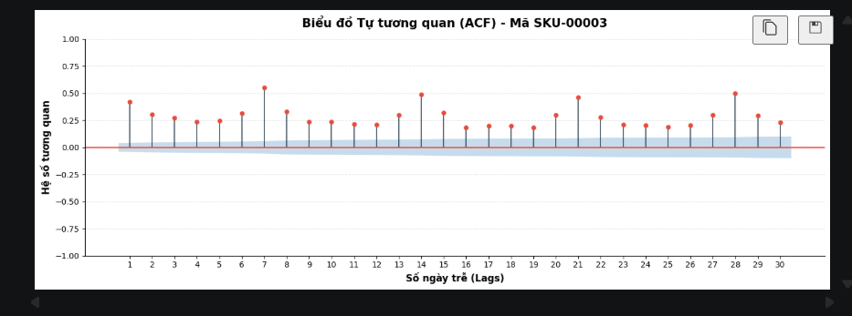

# 🚗 Mô Hình Dự Báo Số Lượng Bán Ra - Phụ Tùng Ô Tô (WRMSSE)


---

## 📝 Giới thiệu chung
Dự án tập trung vào việc giải quyết bài toán dự báo nhu cầu bán lẻ phức tạp: **Dự báo số lượng bán ra hàng ngày cho ~15,972 mã sản phẩm (SKU)** của một nhà phân phối Phụ tùng Ô tô tại Việt Nam trong vòng **56 ngày tới**. 

Dữ liệu lịch sử giao dịch trải dài gần 5 năm (từ 17/11/2020 đến 05/09/2025). Đây là bài toán thực tế với hai thách thức lớn:
* **Phân phối Long-tailed:** Một nhóm nhỏ SKU mang lại phần lớn lợi nhuận, trong khi phần lớn SKU còn lại có lượng bán rất thưa thớt (sparse data).
* **Giao dịch trả hàng (Returns):** Sự xuất hiện của các giá trị âm trong lịch sử bán hàng cần được xử lý phù hợp.

---

## 🎯 Mục tiêu dự án
* **Dự báo chính xác:** Xác định số lượng bán ra hàng ngày của từng SKU trong thời gian 56 ngày chia làm 2 giai đoạn:
    * *Giai đoạn 1 (Validation - F1..F28):* Từ 06/09/2025 đến 03/10/2025.
    * *Giai đoạn 2 (Evaluation - F29..F56):* Từ 04/10/2025 đến 31/10/2025.
* **Tối ưu theo Metric WRMSSE:** Đạt chỉ số sai số thấp nhất trên mô hình, đặc biệt ưu tiên độ chính xác ở các mã sản phẩm có đóng góp lợi nhuận cao cho doanh nghiệp.

---

## 🛠️ Công nghệ và Thư viện sử dụng
* **Ngôn ngữ lập trình:** Python (>= 3.9)
* **Xử lý & Biến đổi dữ liệu:** `pandas`, `numpy`
* **Trực quan hóa đồ thị:** `matplotlib`, `seaborn`
* **Thuật toán Học máy (Machine Learning):** `LightGBM`, `Naive Forcast`
* **Môi trường thử nghiệm:** Jupyter Notebook / VS Code

---

## 📊 Quy trình thực hiện (Pipeline)

### 1. Tiền xử lý dữ liệu (Data Preprocessing)
* Chuyển đổi dữ liệu từ dạng nhật ký giao dịch (transactional) sang chuỗi thời gian hàng ngày (daily time-series).
* Xử lý các ngày không phát sinh giao dịch bằng kỹ thuật điền số 0 (Zero-filling).
* Khử nhiễu và xử lý các giao dịch trả hàng (số lượng âm).

### 2. Kỹ thuật đặc trưng (Feature Engineering)
* **Đặc trưng thời gian (Time features):** Thứ trong tuần, ngày trong tháng, tháng, năm và các ngày lễ lớn tại Việt Nam (Tết Nguyên Đán, 30/4, Quốc Khánh...).
* **Biến trễ & Cửa sổ trượt (Lag & Rolling features):** Tạo độ trễ  ngày (để tránh rò rỉ dữ liệu khi dự báo dài hạn) kết hợp tính toán trung bình trượt (`rolling mean`, `rolling std`) theo các chu kỳ 7, 14, 28 ngày.
* **Trọng số lợi nhuận (Profit Weighting):** Tính toán lũy kế lợi nhuận của từng SKU trên tập Train để gán trọng số ưu tiên:
    $$\text{profit}_i = \sum (\text{SalesAmount} - \text{CostAmount})$$
    *(Nếu profit < 0 sẽ được đưa về bằng 0).*

*Hình ảnh minh họa đặc trưng thời gian của 1 trong các mã hàng SKU chiếm phần lớn lợi nhuận:*


### 3. Xây dựng Baseline (Mô hình cơ sở)
Trước khi áp dụng Học máy, một mô hình **Naive Forecast** được thiết lập để làm cột mốc so sánh (Baseline).
* **Phương pháp:** Sử dụng giá trị thực tế của chuỗi ngày liền trước để làm dự báo cho chuỗi ngày tiếp theo. Cụ thể, do chu kỳ dự báo là 56 ngày, mô hình Naive sẽ lấy dữ liệu của 56 ngày cuối cùng trong tập Train (`12/07/2025` $\rightarrow$ `05/09/2025`) để "gán" trực tiếp làm kết quả dự báo cho 56 ngày tiếp theo (`F1` $\rightarrow$ `F56`).
* **Vai trò:** Giá trị chỉ số WRMSSE của Baseline này là **`0.66497`**.

### 4. Huấn luyện mô hình với LightGBM
* Xây dựng mô hình toàn cục (Global Model) bằng **LightGBM** để huấn luyện đồng thời trên tất cả ~15,972 SKUs thay vì train từng mô hình riêng lẻ.
* Đưa các đặc trưng thời gian, biến trễ (Lag) và biến trượt (Rolling) đã tạo ở bước 2 vào mô hình để cấu trúc lại bài toán chuỗi thời gian thành bài toán Supervised Learning (Học có giám sát).
* Tinh chỉnh Hyperparameters (Learning rate, Num leaves, Max depth) dựa trên điểm WRMSSE của tập Public Validation nhằm tối ưu hóa độ chính xác cho các nhóm hàng sinh lời cao.

---

## 📈 Kết quả đạt được
Hiệu năng của mô hình được đánh giá bằng toán tử **WRMSSE** (Weighted Root Mean Squared Scaled Error) - Điểm càng thấp càng tốt.

| Mô hình (Model) | Public WRMSSE (F1-F28) |
| :--- | :---: |
| **Baseline** | `0.66497` |
| **LightGBM** | `0.55407` |

> 📌 **Nhận xét:** Mô hình LightGBM sau khi tối ưu đã cải thiện đáng kể ($WRMSSE < 1$) so với phương pháp Naive Forcast, kiểm soát tốt hiện tượng over-predict ở các SKU thưa thớt và bắt trọn xu hướng mua sắm có tính chu kỳ của các nhóm linh kiện cốt lõi.

---

## 📁 Cấu trúc thư mục dự án
```text
├── clean data code/
│   └── clean_data_code.ipynb
├── image/
│   └── graph.png
├── EDA.IPYNB
├── Feature.ipynb
├── HBBA_Competition.ipynb
├── ML.ipynb
-baseline.py
└── TIME.ipynb

